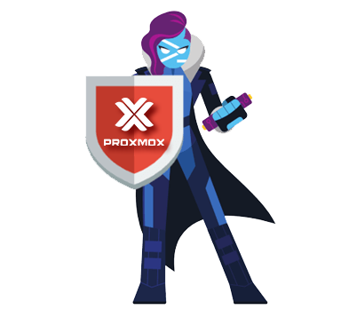

# cv4pve-api-pwsh

[](LICENSE.md)


[ProxmoxVE Api](https://pve.proxmox.com/pve-docs/api-viewer/)

```text
    ______                _                      __
   / ____/___  __________(_)___ _   _____  _____/ /_
  / /   / __ \/ ___/ ___/ / __ \ | / / _ \/ ___/ __/
 / /___/ /_/ / /  (__  ) / / / / |/ /  __(__  ) /_
 \____/\____/_/  /____/_/_/ /_/|___/\___/____/\__/

powerShell for Proxmox VE         (Made in Italy)

cv4pve-api-pwsh is a part of suite cv4pve-tools.
For more information visit https://www.cv4pve-tools.com
```

## Copyright and License

Copyright: Corsinvest Srl
For licensing details please visit [LICENSE.md](LICENSE.md)

## Commercial Support

This software is part of a suite of tools called cv4pve-tools. If you want commercial support, visit the [site](https://www.cv4pve-tools.com)

## Introduction

PowerShell for Proxmox VE.



this is a CmdLet for PowerShell to manage Proxmox VE.

## Main features

* Easy to learn
* Set ResponseType json, png
* Full class and method generated from documentation (about client)
* Comment any method and parameters
* Parameters indexed eg [n] is structured in array index and value
* Return data Proxmox VE
* Return result class more information PveResponse
  * Request
  * Response
  * Status
* Utility
  * ConvertFrom-PveUnixTime
  * Wait-PveTaskIsFinish
  * Get-PveTaskIsRunning
  * Build-PveDocumentation
  * Find-PveVM (from id or name)
  * Unlock-PveVM (from id or name)
  * Start-PveVM (from id or name)
  * Stop-PveVM (from id or name)
  * Suspend-PveVM (from id or name)
  * Resume-PveVM (from id or name)
  * Reset-PveVM (from id or name)
  * And More
* Method direct access using Invoke-PveRestApi return PveResponse
* Connect-PveCluster accept multiple hosts for HA
* Completely written in PowerShell
* Use native api REST Proxmox VE
* Independent os (Windows, Linux, Macosx)
* Installation from PowerShellGallery or download file
* Not require installation in Proxmox VE
* Execute out side Proxmox VE
* Open Source
* Form Proxmox VE 6.2 support Api Token for user

## Api token

From version 6.2 of Proxmox VE is possible to use [Api token](https://pve.proxmox.com/pve-docs/pveum-plain.html).
This feature permit execute Api without using user and password.
If using **Privilege Separation** when create api token remember specify in permission.
Format USER@REALM!TOKENID=UUID

## Installation

Install [PowerShell](https://docs.microsoft.com/en-us/powershell/scripting/install/installing-powershell) in your system.

**From PowerShell Gallery (this moment not working)**

Open PowerShell and install module form [gallery](https://www.powershellgallery.com/)

```ps
PS /home/frank> Install-Module -Name Corsinvest.ProxmoxVE.Api
```

**Manual**

Download folder Corsinvest.ProxmoxVE.Api and copy in path module

```ps
# show path module
PS /home/frank> [Environment]::GetEnvironmentVariable("PSModulePath")
```

## Connect to cluster

For connection use the function Connect-PveCluster. This function generate a Ticket object that refer a PveTicket class.
The first connection saved ticket data in the variable $Global:PveTicketLast. In the various functions, the -PveTicket parameter is the connection reference ticket. If not specified will be used $Global:PveTicketLast.

## PveTicket Class

This class contain data after connection and login Connect-PveCluster

```ps
class PveTicket {
    [string] $HostName = ''
    [int] $Port = 8006
    [bool] $SkipCertificateCheck = $true
    [string] $Ticket = ''
    [string] $CSRFPreventionToken = ''
    [string] $ApiToken = ''
}
```

## PveResponse Class

This class contain data after execution any command

```ps
class PveResponse {
    #Contain real response of Proxmox VE
    #Is converted in object Json response
    [PSCustomObject] $Response
    [int] $StatusCode = 200
    [string] $ReasonPhrase
    [bool] $IsSuccessStatusCode = $true
    [string] $RequestResource
    [hashtable] $Parameters
    [string] $Method
    [string] $ResponseType

    [bool] ResponseInError() { return $null -ne $this.Response.error }
    [PSCustomObject] ToTable() { return $this.Response.data | Format-Table }
    [PSCustomObject] GetData() { return $this.Response.data }
    [void] ToCsv([string] $filename) { $this.Response.data | Export-Csv $filename }
}
```

## Usage

Example Connect and get version

```ps
#Connection to cluster user and password
PS /home/frank> Connect-PveCluster -HostsAndPorts 192.168.190.191:8006,192.168.190.192 -SkipCertificateCheck
PowerShell credential request
Proxmox VE Username and password, username formatted as user@pam, user@pve, user@yourdomain or user (default domain pam).
User: test
Password for user test: ****

#return Ticket, default set $Global:PveTicketLast
#this is useful when connections to multiple clusters are needed use parameter -SkipRefreshPveTicketLast
HostName             : 192.168.190.191
Port                 : 8006
SkipCertificateCheck : True
Ticket               : PVE:test@pam:5EFF3CCA::iXhSNb5NTgNUYznf93mBOhj8pqYvAXoecKBHCXa3coYwBWjsWO/x8TO1gIDX0yz9nfHuvY3alJ0+Ew5AouOTZlZl3NODO9Cp4Hl87qnzhsz4wvoYEzvS1NUOTBekt+yAa68jdbhP
                        OzhOd8ozEEQIK7Fw2lOSa0qBFUTZRoMtnCnlsjk/Nn3kNEnZrkHXRGm46fA+asprvr0nslLxJgPGh94Xxd6jpNDj+xJnp9u6W3PxiAojM9g7IRurbp7ZCJvAgHbA9FqxibpgjaVm4NCd8LdkLDgCROxgYCjI3eR
                        gjkDvu1P7lLjK9JxSzqnCWWD739DT3P3bW+Ac3SyVqTf8sw==
CSRFPreventionToken  : 5EFF3CCA:Cu0NuFiL6CkhFdha2V+HHigMQPk

#Connection to cluster using Api Token
PS /home/frank> Connect-PveCluster -HostsAndPorts 192.168.190.191:8006,192.168.190.192 -SkipCertificateCheck -ApiToken root@pam!qqqqqq=8a8c1cd4-d373-43f1-b366-05ce4cb8061f
HostName             : 192.168.190.191
Port                 : 8006
SkipCertificateCheck : True
Ticket               :
CSRFPreventionToken  :
ApiToken             : root@pam!qqqqqq=8a8c1cd4-d373-43f1-b366-05ce4cb8061f

#For disable output call Connect-PveCluster > $null

#Get version
PS /home/frank> $ret = Get-PveVersion

#$ret return a class PveResponse

#Show data
PS /home/frank> $ret.Response.data
repoid   release keyboard version
------   ------- -------- -------
d0ec33c6 15      it       5.4

#Show data 2
PS /home/frank> $ret.ToTable()
repoid   release keyboard version
------   ------- -------- -------
d0ec33c6 15      it       5.4
```

Get snapshots of vm

```ps
PS /home/frank> (Get-PveNodesQemuSnapshot -Node pve1 -Vmid 100).ToTable()

vmstate name                         parent                       description       snaptime
------- ----                         ------                       -----------       --------
      0 autowin10service200221183059 autowin10service200220183012 cv4pve-autosnap 1582306261
      0 autowin10service200220183012 autowin10service200219183012 cv4pve-autosnap 1582219813
      0 autowin10service200224183012 autowin10service200223183014 cv4pve-autosnap 1582565413
      0 autowin10service200223183014 autowin10service200222183019 cv4pve-autosnap 1582479015
      0 autowin10service200215183012 autowin10service200214183012 cv4pve-autosnap 1581787814
      0 autowin10service200216183017 autowin10service200215183012 cv4pve-autosnap 1581874219
      0 autowin10service200218183010 autowin10service200216183017 cv4pve-autosnap 1582047011
      0 autowin10service200219183012 autowin10service200218183010 cv4pve-autosnap 1582133413
      0 autowin10service200214183012                              cv4pve-autosnap 1581701413
      0 autowin10service200222183019 autowin10service200221183059 cv4pve-autosnap 1582392621
        current                      autowin10service200224183012 You are here!
```

Other method

```ps
(Find-PveVM -VmIdOrName 100 | Get-PveNodesQemuSnapshot).ToTable()
vmstate name                         parent                       description       snaptime
------- ----                         ------                       -----------       --------
      0 autowin10service200221183059 autowin10service200220183012 cv4pve-autosnap 1582306261
      0 autowin10service200220183012 autowin10service200219183012 cv4pve-autosnap 1582219813
      0 autowin10service200224183012 autowin10service200223183014 cv4pve-autosnap 1582565413
      0 autowin10service200223183014 autowin10service200222183019 cv4pve-autosnap 1582479015
      0 autowin10service200215183012 autowin10service200214183012 cv4pve-autosnap 1581787814
      0 autowin10service200216183017 autowin10service200215183012 cv4pve-autosnap 1581874219
      0 autowin10service200218183010 autowin10service200216183017 cv4pve-autosnap 1582047011
      0 autowin10service200219183012 autowin10service200218183010 cv4pve-autosnap 1582133413
      0 autowin10service200214183012                              cv4pve-autosnap 1581701413
      0 autowin10service200222183019 autowin10service200221183059 cv4pve-autosnap 1582392621
        current                      autowin10service200224183012 You are here!
```
